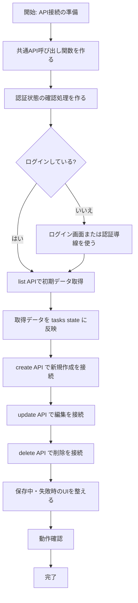
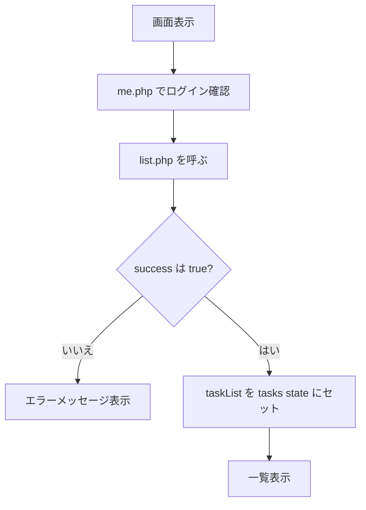
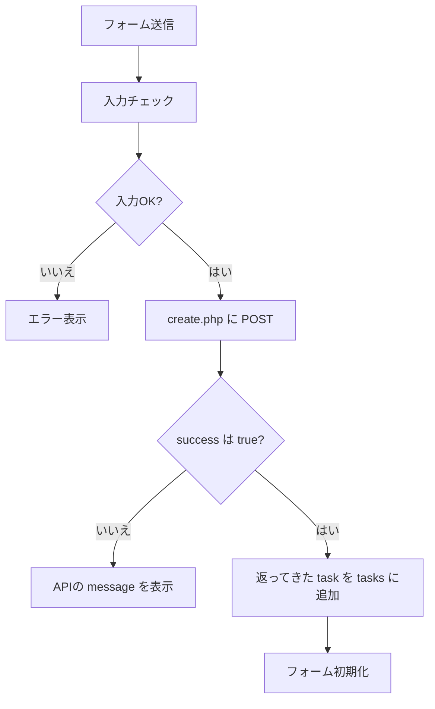
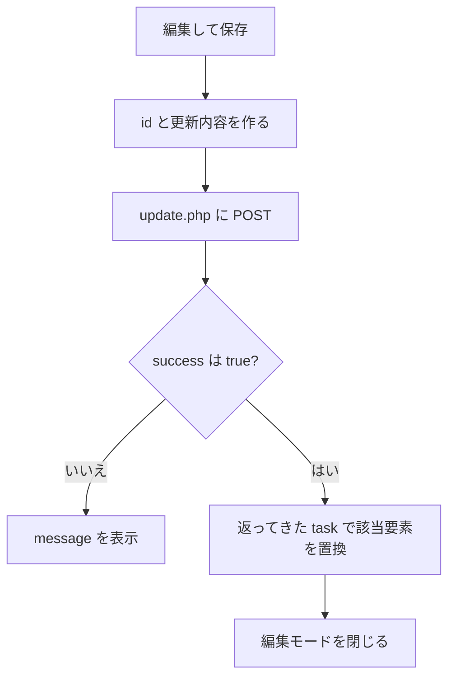
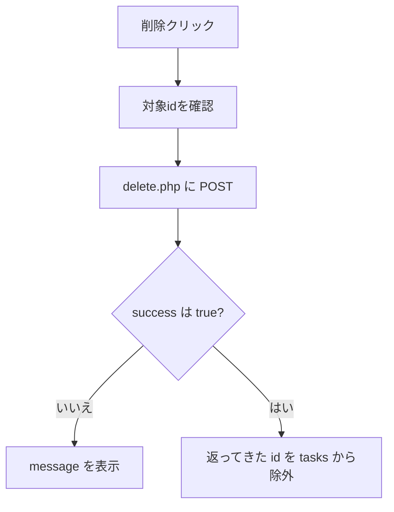
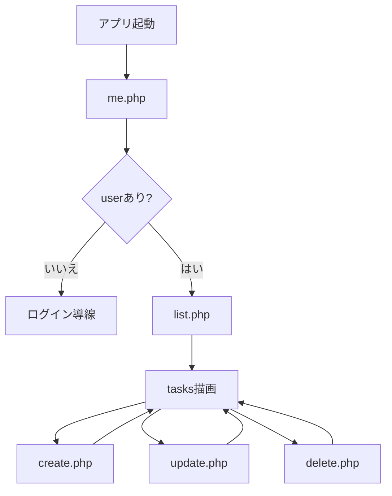

# フロント連携フローチャート

## 目的

現在の React フロントを、修正済みの PHP API に少しずつつないでいくための実装順を整理する。

React 側はまだローカル state 中心で動いているため、いきなり全部を API 化するのではなく、段階的に置き換えるのが安全。

## 全体フロー

## 実装フロー詳細

### 1. 共通API呼び出し関数を作る

最初にやることは、`fetch` の共通化。

最低限そろえたいもの:

- `Content-Type: application/json`
- `credentials: "include"`
- `res.ok` だけでなく JSON の `success` も見る
- 失敗時に `message` を拾う

ここを先に作ると、以後の `create` `update` `delete` `list` がかなり楽になる。

### 2. 認証状態確認を `me.php` で行う

アプリ起動時に `api/me.php` を呼び、ログイン中かどうか確認する。

期待する考え方:

- `user === null` なら未ログイン
- `user` があればログイン済み

これをアプリ全体の初期化の入口にする。

## 3. 一覧取得を最初に接続する

新規作成や更新より前に、`list.php` をつないで初期表示をAPI起点にする。

理由:

- 画面のベースとなる `tasks` をAPI由来にできる
- 以後の create / update / delete の結果反映先が明確になる
- フロント側の task 形状のズレを最初に発見しやすい

### 一覧取得フロー

## 4. create をつなぐ

次に `TaskInput` の送信処理を API 化する。

今はローカル state に直接 `setTasks([...tasks, input])` しているので、流れは次のように置き換える。

### create 実装フロー

### create で実装すべき点

- API送信中の二重送信防止
- 失敗時のメッセージ表示
- 成功時は API が返した `task` をそのまま使う
- フロント側で仮IDを本採用しない

## 5. update をつなぐ

編集保存時にローカル state を直接書き換えるのではなく、`update.php` に送って、返ってきた task で差し替える。

### update 実装フロー

### update で実装すべき点

- `id` を必ず送る
- 更新後はローカル計算ではなく、APIレスポンスで置換する
- 部分更新でも送れるようにする
- 保存中はボタン連打を防ぐ

## 6. delete をつなぐ

削除もローカルで即消すのではなく、API成功後に state から除外する。

### delete 実装フロー

### delete で実装すべき点

- API成功前にUIだけ先に消しすぎない
- 404 のときも message を表示できるようにする
- 成功時は返却 `id` を使って対象を消す

## 7. loading / error 状態を入れる

API接続を始めると、今までなかった「通信中」と「通信失敗」が発生する。

最低限ほしい state:

- `isLoading`
- `isSaving`
- `error`

使いどころ:

- 初期一覧取得中
- 作成中
- 更新中
- 削除中

## 8. state 更新ルールを決める

API接続後は、フロント側で task を適当に組み立てるより、APIが返した task を信頼するほうが安全。

基本ルール:

- list: `taskList` を丸ごと採用
- create: 返却 `task` を追加
- update: 返却 `task` で置換
- delete: 返却 `id` を使って除外

## 9. 実装順のおすすめ

おすすめ順はこの順番。

1. 共通API関数
2. `me.php` で認証確認
3. `list.php` で初期一覧取得
4. `create.php` で作成
5. `update.php` で編集
6. `delete.php` で削除
7. loading / error の調整

この順番にすると、まず「読み込み」が安定し、その後に書き込み系を順番に足せる。

## 最終イメージ

## 補足

今の段階では、React 側の task モデルと API の返却値に少し差がある。

ただし PHP 側は、後から寄せやすいように最低限のキーを返す形にしてあるため、フロントは次の方針で進めると安全。

- まず一覧取得をAPI化する
- 次に作成
- その後で編集・削除
- 最後にUIの細かい整合を取る
