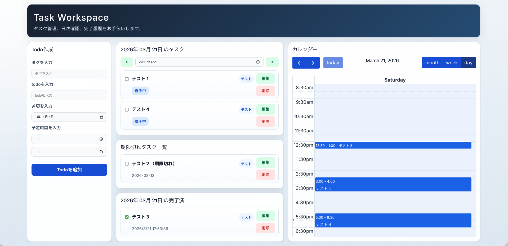

# Task Workplace



React + Vite のフロントエンドと、PHP + MariaDB の API を組み合わせたタスク管理アプリです。  
1画面の中で、日次タスク確認、期限切れ確認、完了確認、カレンダー表示をまとめて扱えるようにしています。

本番環境では `task-workplace.g-tatemichi.com` で公開しています。

## 現在できること

- メールアドレス / パスワードでログイン
- タスクの一覧取得
- タスクの作成
- タスクの更新
- タスクの削除
- 日付ごとのタスク表示
- 期限切れタスク一覧の表示
- 完了タスク一覧の表示
- FullCalendar を使ったカレンダー表示

## テスト用アカウント

- email: `example@example.com`
- password: `123456`

## 使用技術

- React
- Vite
- PHP
- MariaDB
- Docker / Docker Compose
- Nginx
- FullCalendar
- CSS

## ディレクトリの役割

- `src/`: React フロントエンド
- `api/`: PHP の API
- `config/`: DB 接続設定
- `initdb/`: MariaDB 初期化用 SQL
- `php/`: PHP / Apache 用 Docker 設定
- `deploy/`: VPS / Nginx 用の補助設定

## ローカル開発

### フロントエンド起動

```bash
npm install
npm run dev
```

### Docker 起動

```bash
docker compose up -d --build
```

ローカルでは主に次のポートを使います。

- フロント: `http://localhost:5173`
- PHP API: `http://localhost:8090/api`
- phpMyAdmin: `http://localhost:3410`

## ビルド

```bash
npm run build
```

## VPS デプロイ

VPS 公開用の構成は `docker-compose.vps.yml` を使います。

```bash
cp .env.vps.example .env.vps
docker compose --env-file .env.vps -f docker-compose.vps.yml up -d --build
```

詳細な手順は [VPS_DEPLOY.md](./VPS_DEPLOY.md) にまとめています。

## 補足

学習用の実装として、処理の流れが追いやすいように全体をできるだけ素直な構成にしています。  
フロントと API を段階的につなぎながら、Docker と VPS 公開まで含めて確認できる形を意識しています。
